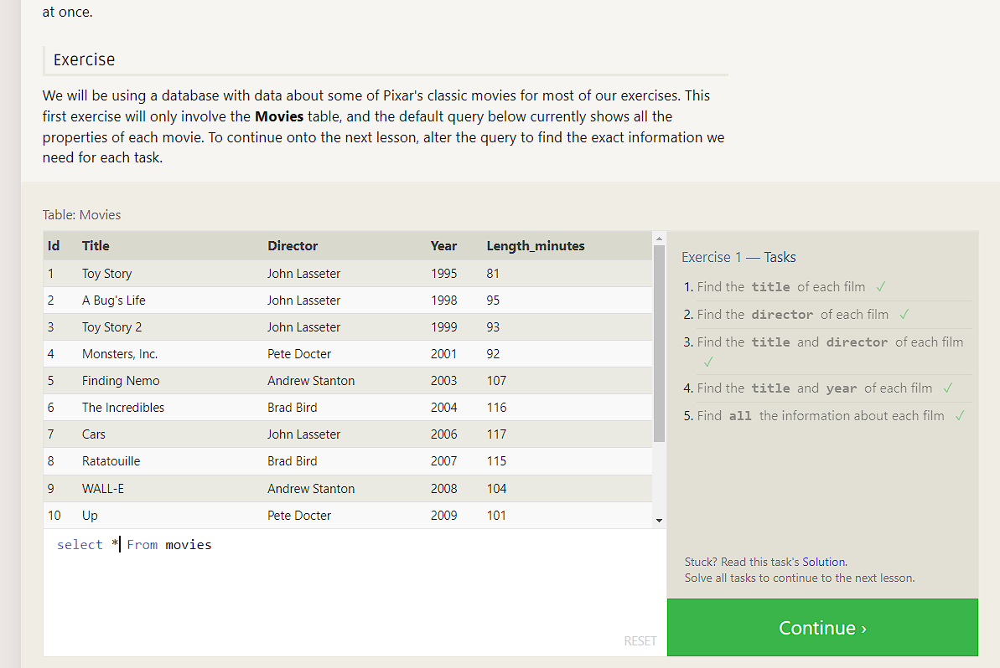

# SQL Database Tutorials

Create a new database:
To create a new database, you must open up a SQL editor, such as MySQL Workbench or pgAdmin. Once you have the editor open, The following command can be used to create a new database:
            CREATE DATABASE sql_name;

Replace "sql_name" with the name you want to give your database. This will create a fresh database with the given name.

## Create a table:

To create a table in your database, you will need to run the following command:

CREATE TABLE table_name ( column_name1 data_type, column_name2 data_type, ... );

Replace "table_name" with the name you want to give your table and "column_name" and "data_type" with the name and type of each column in your table. For instance, you might create a table called "users" with columns for "id", "username", and "password":
            CREATE TABLE users ( id INTEGER PRIMARY KEY, username VARCHAR(255), password VARCHAR(255) );

## Insert data into a table:

To insert data into a table, you need to use the INSERT INTO command. For example, to insert a new user into the "users" table, you might run the following command:
            INSERT INTO users (username, password) VALUES ('username', 'password');

This will insert a new row into the "users" table with the given username and password.

## Query data from a table:

You need to use the SELECT command to query data from a table. For example, to retrieve all rows from the "users" table, you might run the following command:

     SELECT * FROM users;

 This will return all rows in the "users" table. You can also specify specific columns to retrieve or add a WHERE clause to filter the results.

## Update data in a table:

To update data in a table, you must use the UPDATE command. For example, to update the password for a specific user, you might run the following command:

            UPDATE users SET password = 'new_password' WHERE username = 'username';

This will update the password for the user with the given username.

## Delete data from a table:

You need to use the DELETE command to delete data from a table. For example, to delete a specific user from the "users" table, you might run the following command:
            DELETE FROM users WHERE username = 'username';

This will delete the user with the given username from the "users" table.

## SQL Tutorial PDF: Basics PDF for Beginners

Here is a brief tutorial on the basics of Structured Query Language (SQL) for beginners:

Introduction to SQL
SQL is a database programming language that is used to manipulate and manage data stored in relational databases.

SQL is a standard language used by most relational database management systems (RDBMS) such as MySQL, Oracle, MS SQL Server, and others.

Basic SQL commands
INSERT: used to add new data to a database.

SELECT: used to retrieve data from a database.

DELETE: used to delete data from a database.

UPDATE: used to modify existing data in a database.

Data types
VARCHAR stores character strings (such as names or addresses).

INTEGER: used to store numerical data.

DATE: used to store date values.

Operators
AND: used to combine two or more conditions.

OR: used to specify that either of the two conditions can be true.

BETWEEN: used to specify a range of values.

Creating tables
CREATE TABLE: used to create a new table in a database.

Modifying tables
ALTER TABLE: used to modify an existing table in a database.

Querying data
WHERE: used to filter the results of a SELECT statement based on specified conditions.

Joining tables
INNER JOIN combines rows from two or more tables based on a common column.

LEFT JOIN: return all the rows from the left table and any rows from the right table that match them.

